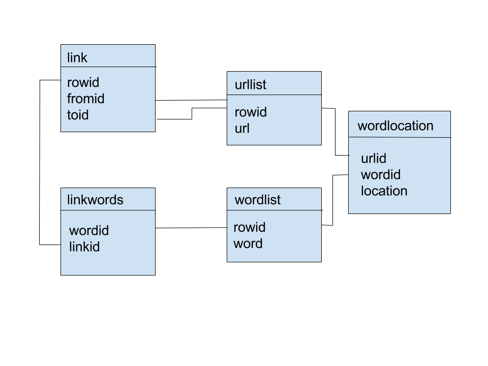

# Working with Databases

Have you ever wondered how a search engine works? Today we will build one together. The basic components include:

- a way to download HTML content from the web
- a collection of webpages that you've downloaded
- a database to put that collection in (we'll use SQLite)
- a way to index the pages
- a way to parse the pages to mine for other URLs
- a way to submit a search query
- a way to return a ranked list of pages based on that query

Since the goal of this workshop is to build a functional database, that will be the focus. For that reason, we've left those methods in template form and have supplied other methods for you.

We'll discuss ranking and recommender systems in more detail in the Machine Learning and Applied Data Science courses. For those of you who are interested in implementing a ranking tool or recommender system in your capstone project, or if you're curious about how the search query component works, we highly recommend the book from which this exercise is derived, Toby Segaran's Programming Collective Intelligence.

## Getting Started

In order to do this workshop, you'll need to install some third party dependencies, notably, BeautifulSoup. To do this, use pip:

    $ pip install beautifulsoup

Note this requirements file in this directory contains all the third party dependencies required, and you can install them using the `-r` flag on pip:

    $ pip install -r requirements.txt

Next create a file called `searchy.py` (or clone, download, or copy the file in this directory). While you're coding, simply execute the file:

    $ python searchy.py

Right now you should see the following:

    $ python searchy.py
    Traceback (most recent call last):
      File "searchy.py", line 319, in <module>
        crawly.createindextables()
      File "searchy.py", line 113, in createindextables
        self.con.execute('create index wordidx on wordlist(word)')
    AttributeError: 'Crawler' object has no attribute 'con'

That's because it's your job to implement the database handling portion of this code! Take a look at the following functions to get started.

1. `Crawler.__init__` on line 64
2. `Crawler.__del__` on line 78
3. `Crawler.dbcommit` on line 84
4. `Crawler.createindextables` on line 90

Once you've filled in the database handling utilities, you'll be able to run the code! After you've got it working, take a look at what's in the database using SQLite on the command line (or a SQLite GUI browser). Then review how the search and storage process is working. See if you can modify it or make it better!

## Notes on creating databases.



The above schema is what you'll want your database to look like. Remember you can create tables using SQL syntax as follows:

```SQL
CREATE TABLE link (
    rowid INTEGER PRIMARY KEY AUTOINCREMENT,
    fromid INTEGER,
    toid INTEGER
);
```

I recommend you read https://docs.python.org/2/library/sqlite3.html to figure out the commands for SQLite - it will make the lab a lot easier!
